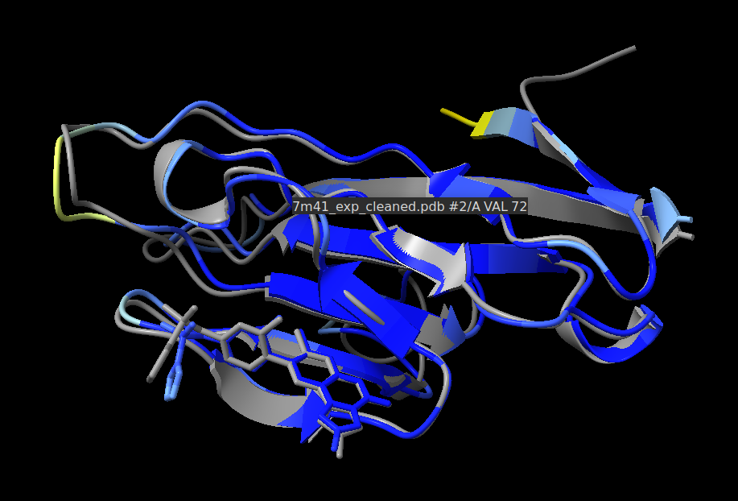

# AlphaFold 3 Tutorial Series

This repository offers an introduction to AlphaFold 3, focusing on understanding its architecture, running structure predictions, and interpreting prediction results.

<div align="center">

</div>
------

## Walkthrough Overview

This tutorial series starts with a **walkthrough**, which provides a high-level introduction to the model’s architecture, key modules (Pairformer and diffusion), and important features such as recycling, confidence metrics, and handling of small molecules. This walkthrough is designed to be installation-free and server-based, making it easy for users to get started without any local installations.

> [Open the Walkthrough in Colab](https://colab.research.google.com/github/richcmwang/AlphaFold-3-Tutorial-Series/blob/main/tutorials/af3_walkthrough.ipynb)

------

## Available Tutorial

### [1. Predicting ATP-Bound PKA (1ATP)](https://colab.research.google.com/github/richcmwang/AlphaFold-3-Tutorial-Series/blob/main/tutorials/af3_1ATP_server_tutorial.ipynb)

Learn how to:

- Use the AlphaFold 3 server to predict a protein–ligand complex
- Visualize the results with **ChimeraX** (offline screenshots provided)
- Compare the predicted structure with the crystal structure (PDB: 1ATP)
- Zoom into the ligand binding site and compute RMSD
- Interpret structural confidence using pLDDT and PAE

> This tutorial includes some Python code to display results and guide analysis, but no local AlphaFold 3 or Docker installation is required. ChimeraX is optional but recommended for offline exploration.

------

### [2. Predicting Protein–Ligand Binding in 7M41 with AlphaFold 3](https://colab.research.google.com/github/richcmwang/AlphaFold-3-Tutorial-Series/blob/main/tutorials/af3_7M41_local_tutorial.ipynb)

Learn how to:

- Install and run AlphaFold 3 locally, including setting up Docker and pulling the latest model image.
- Reproduce the protein–ligand structure of 7M41, including the custom ligand YQG, which is not supported by the public AlphaFold 3 server.
- Perform output analysis by examining key metrics like pLDDT, PAE, and RMSD to assess model confidence and structure quality.
- Visualize and compare 3D structures using NGLView, enabling interactive exploration and alignment of predicted and experimental models.

------

## Getting Started

Clone the repository and begin with the walkthrough or the 1ATP tutorial:

```bash
git clone https://github.com/richcmwang/AlphaFold-3-Tutorial-Series.git
cd tutorials
```

Open the walkthrough here:
 `tutorials/af3_walkthrough.ipynb`

Or open the first tutorial here:
 `tutorials/af3_1ATP_server_tutorial.ipynb`
